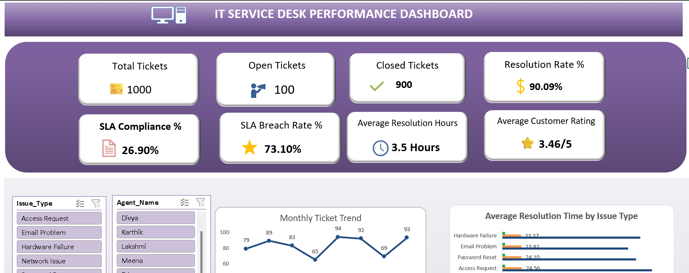
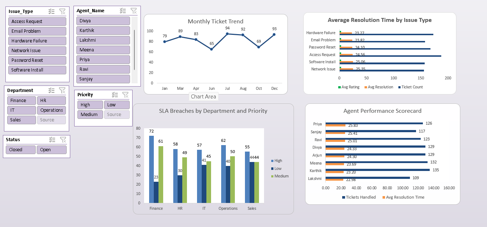
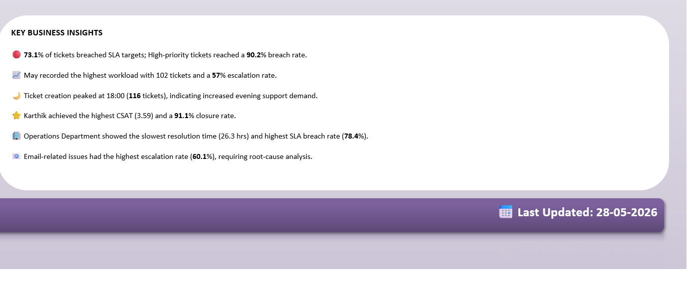

# IT Service Desk Performance & SLA Analytics Dashboard 2026

## Project Overview

This project is an interactive Excel dashboard developed to analyze IT Service Desk operations, monitor SLA compliance, evaluate ticket resolution efficiency, and measure agent performance.

The dashboard transforms raw ticket data into meaningful business insights using Excel analytics and visualization techniques.

---

## Technologies Used

* Microsoft Excel
* Pivot Tables
* Pivot Charts
* Slicers
* Data Validation
* Conditional Formatting
* IF Functions
* COUNTIF Functions
* AVERAGE Functions
* Dashboard Design
* Data Visualization

---

## Business Objective

The objective of this project is to:

* Monitor service desk performance
* Track SLA compliance and breaches
* Analyze ticket resolution efficiency
* Evaluate agent productivity
* Improve operational decision-making

---

## Dataset Overview

The dataset contains IT support ticket information including:

* Ticket ID
* Created Date & Time
* Closed Date & Time
* Department
* Issue Type
* Priority
* Agent Name
* Ticket Status
* Resolution Time
* SLA Target Hours
* Customer Rating
* Escalation Status

---

## Data Validation Implemented

To improve data quality and prevent incorrect entries, the following validations were applied:

* Status → Open, Closed
* Priority → High, Medium, Low
* Department → IT, Operations, HR, Finance, Sales
* Customer Rating → Whole Number (1–5)
* Resolution Category → Fast, On-Time, Delayed, Critical
* Issue Type → Dropdown List
* Custom Error Alerts and Input Messages

---

## Conditional Formatting

Applied conditional formatting to highlight important records:

* SLA Status
* Priority Level
* Within SLA

This enables quick identification of SLA breaches and critical tickets.

---

## Dashboard KPIs

* Total Tickets
* Closed Tickets
* Open Tickets
* Resolution Rate (%)
* SLA Compliance (%)
* SLA Breach Rate (%)
* Average Resolution Time
* Average Customer Rating

---

## Dashboard Features

### Monthly Ticket Trend

Tracks ticket volume over time.

### SLA Breach Analysis

Analyzes SLA violations by department and priority.

### Agent Performance Scorecard

Measures agent productivity and efficiency.

### Resolution Time Analysis

Compares average resolution time across issue types.

### Interactive Slicers

Filters dashboard by:

* Department
* Priority
* Status
* Agent Name
* Issue Type

---

## Dashboard Screenshots

Add your uploaded screenshots here.

---

## Key Business Insights

* SLA breach rate is significantly higher than SLA compliance.
* High-priority tickets require improved response management.
* Agent performance varies across ticket categories.
* Resolution times differ based on issue type.
* Interactive filtering enables detailed operational analysis.

---

## Skills Demonstrated

* Excel Dashboard Development
* Data Validation
* Conditional Formatting
* KPI Design
* Business Analysis
* Data Visualization
* Pivot Tables & Pivot Charts
* Interactive Reporting

---

## Project Files

* IT_ServiceDesk_Performance_2026.xlsx
* IT_ServiceDesk_Project_Presentation.pptx
* Dashboard_Screenshot_1.png
* Dashboard_Screenshot_2.png
* Dashboard_Screenshot_3.png

---

## Author

**Ranjithkumar M**

Aspiring Data Analyst | Excel | SQL | Power BI | Data Visualization
